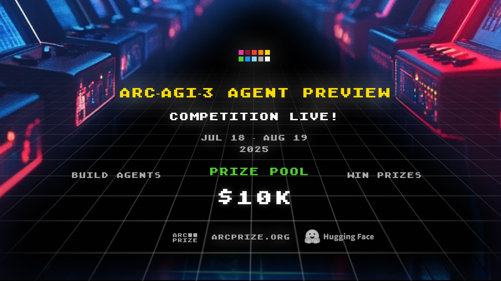

# TOMAS Engine 🧠

<p>
    
    
</p>

**Multi-Agent AI System for [ARC-AGI-3 Agent Preview Competition](https://three.arcprize.org/)**



TOMAS (Thinking, Observing, Modeling, and Acting System) mimics human cognitive processes through three specialized AI agents: **perception**, **learning**, and **strategic decision-making**.


## 🎯 **The Three Minds**

**🏞️ AISTHESIS** - _"What changed?"_

- Analyzes game frames with mathematical precision
- Provides movement vectors, spatial relationships, clickable coordinates
- Always delivers precise coordinates for LOGOS decisions

**🧠 SOPHIA** - _"What are the rules?"_

- Rapidly generates and tests game mechanic hypotheses
- **Rule Consolidation**: "Etches successful patterns into memory" when levels complete
- 3 pathways to promote theories into confirmed rules

**⚡ LOGOS** - _"What should I do?"_

- Makes strategic decisions using human-like psychology
- 5 mental states: Exploring, Pattern-seeking, Testing, Optimization, Frustrated
- Chooses 1-5 action sequences based on confidence and emotional state

---

## 🔄 **How It Works**

```
Game State → AISTHESIS → SOPHIA → LOGOS → Actions → Game State
```

1. **🏞️ AISTHESIS** analyzes visual changes with mathematical precision
2. **🧠 SOPHIA** learns patterns and consolidates successful rules
3. **⚡ LOGOS** decides next actions using human-like psychology
4. **🎯 Actions** execute and cycle repeats

## 🧪 **Key Innovations**

- **Rule Consolidation**: Successful patterns become permanent knowledge
- **Human Psychology**: AI experiences frustration, curiosity, and confidence
- **Mathematical Analysis**: Precise movement vectors and spatial relationships
- **Persistent Learning**: Knowledge transfers across levels

## 🚀 **Getting Started**

```bash
# Run TOMAS Engine on all 3 competition games simultaneously  
uv run main.py --agent=tomasengine
```

**Configuration**: 60 moves per game (optimized for ARC-AGI-3 leaderboard performance)  
**Requirements**: Google Gemini API, UV package manager

---

**🧠 TOMAS Engine - Where AI meets human cognition for the [ARC-AGI-3 Challenge](https://three.arcprize.org/)**
