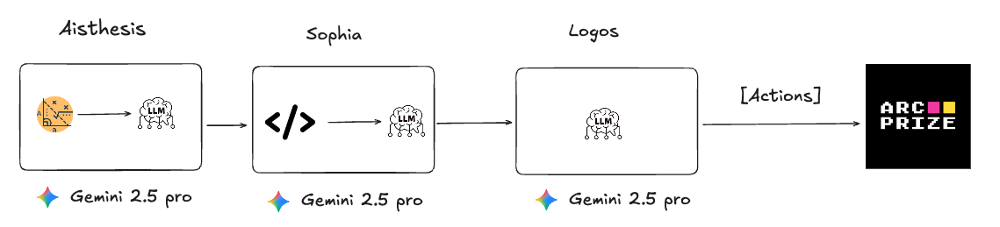

# TOMAS Engine

<p>
                
</p>

**Multi-Agent AI System for ARC-AGI Challenge**

TOMAS (Thinking, Observing, Modeling, and Acting System) is an advanced AI architecture that mimics human cognitive processes to solve complex visual reasoning puzzles. The system combines perception, learning, and decision-making through three specialized AI agents working in harmony.



## 🎯 **Architecture Overview**

TOMAS Engine operates on a **perceive → learn → decide → act** cycle, where each component specializes in a specific cognitive function:

- **🏞️ AISTHESIS**: Perception & Visual Analysis
- **🧠 SOPHIA**: Learning & Pattern Recognition
- **⚡ LOGOS**: Strategic Decision Making & Action

## 🏞️ **AISTHESIS - The Perception System**

_"What is there and how did it change?"_

### **Purpose**

AISTHESIS transforms raw pixel data into structured, objective visual analysis. It acts as the "eyes" of TOMAS, providing factual observation without interpretation.

### **Key Features**

#### **🔍 Enhanced Change Detection**

- **Dual Analysis**: Combines pixel-level comparison with mathematical object detection
- **Movement Vectors**: Calculates precise direction and magnitude of object movements
- **Transformation Classification**: TRANSLATION, ROTATION, MATERIALIZATION, etc.

#### **📊 Mathematical Analysis**

```
PLAYER object moved UP by 8.0 pixels (vector: +0, -8)
from bottom-right to center-right region
```

#### **🎯 Spatial Relationships**

- **Alignments**: Objects sharing rows/columns
- **Proximity**: Adjacent object clusters
- **Pattern Detection**: Grid structures, color groupings

#### **📍 Clickable Coordinates**

- Always provides precise click targets for LOGOS
- Prioritizes visually distinct and potentially interactive elements
- Supports human-like curiosity patterns

### **Input/Output**

- **Input**: Before/After game frames, action executed
- **Output**: Structured analysis + clickable coordinates for next actions

---

## 🧠 **SOPHIA - The Learning Engine**

_"What are the rules and patterns?"_

### **Purpose**

SOPHIA discovers game mechanics through aggressive hypothesis generation and scientific testing. It builds a persistent knowledge base of confirmed rules and active theories.

### **Key Features**

#### **🔬 Aggressive Learning**

- **Rapid Hypothesis Generation**: Creates 2-3 theories from each observation
- **Multiple Pattern Types**: Movement, interaction, transformation, timing patterns
- **Relaxed Promotion Criteria**: 3 pathways to promote hypotheses to confirmed rules

#### **🏆 Rule Consolidation System**

When levels are completed, SOPHIA "etches rules into memory":

```python
# Level completion triggers rule consolidation
🎉 LEVEL UP detected by AISTHESIS keywords!
🔥 CONSOLIDATING PROVEN RULES - Level completed successfully!
🏆 Rule MOVEMENT_UP_001 CONSOLIDATED: confidence 0.7 → 0.85
```

- **Level-Proven Rules**: Become highly resistant to degradation
- **Grace Period**: 25 turns before any degradation (vs 10 for normal rules)
- **High Floor**: Never degrade below 0.7 confidence
- **Philosophy**: "Grabarse las reglas a piel" - successful patterns become permanent knowledge

#### **📈 Performance Tracking**

- **Rule Success History**: Tracks precision and consistency
- **Cross-Validation**: Checks rule conflicts
- **Gradual Degradation**: Unused rules slowly lose confidence

### **Learning Pathways**

1. **High Confidence (0.7+) + Evidence (2+)** → Confirmed Rule
2. **Moderate Confidence (0.6+) + Strong Evidence (4+)** → Confirmed Rule
3. **Consistent Performance (0.5+) + Long Evidence (6+)** → Confirmed Rule

### **Input/Output**

- **Input**: Action executed + AISTHESIS analysis + game context
- **Output**: Confirmed rules + active hypotheses + recommendations

---

## ⚡ **LOGOS - The Strategic Decision Engine**

_"What should I do next?"_

### **Purpose**

LOGOS makes strategic decisions using human-like psychology and reasoning. It considers both learned rules and emotional states to choose optimal action sequences.

### **Key Features**

#### **🧠 Human-Like Psychology**

LOGOS operates with realistic mental states that affect decision-making:

**🔍 EXPLORING** (High curiosity, low confidence)

- Prefers shorter sequences (1-2 actions) for learning
- High risk tolerance, focuses on discovery

**🔍 PATTERN_SEEKING** (Moderate curiosity, building confidence)

- Medium sequences (2-3 actions), systematic approach
- Balances exploration with caution

**🧪 HYPOTHESIS_TESTING** (Low curiosity, moderate confidence)

- Focused sequences (1-2 actions) for specific testing
- Low risk tolerance, only tests proven theories

**⚡ OPTIMIZATION** (Very low curiosity, high confidence)

- Longer efficient sequences (3-5 actions)
- Very low risk tolerance, sticks to what works

**😤 FRUSTRATED** (Variable curiosity, low confidence, high frustration)

- Single actions for quick feedback
- Completely changes strategy, tries radical approaches

#### **🎯 Decision Process**

1. **Assess Psychological State**: What's my mental/emotional state?
2. **Analyze Previous Accuracy**: How well did my prediction match reality?
3. **Review SOPHIA's Rules**: What patterns have been learned?
4. **Apply Psychological Filters**: How does my state affect decision-making?
5. **Plan Action Sequence**: 1-5 actions considering psychology + human-interesting targets
6. **Execute with Confidence**: Output sequence with confidence adjustment

#### **🎮 Action Types**

- **Movement**: `up`, `down`, `left`, `right`
- **Special**: `space`
- **Interaction**: `click` with precise coordinates from AISTHESIS

### **Input/Output**

- **Input**: World state + SOPHIA's rules + psychological state + prediction accuracy
- **Output**: Action sequence (1-5 actions) + expected outcome + confidence level

---

## 🔄 **System Flow**

### **Complete Cycle**

```
1. 🎮 Game presents puzzle state
2. 🏞️ AISTHESIS analyzes visual changes objectively
3. 🧠 SOPHIA learns patterns and updates rule knowledge
4. ⚡ LOGOS decides next actions using psychology + rules
5. 🎯 Actions execute in game environment
6. 📊 Results feed back into next cycle
```

### **Data Flow Between Modules**

**AISTHESIS → SOPHIA:**

- Structured object analysis (changed/unchanged objects)
- Transformation classifications
- Movement vectors and spatial relationships
- Clickable coordinates

**SOPHIA → LOGOS:**

- Confirmed rules with confidence levels
- Active hypotheses to test
- Most reliable actions
- Recommended experiments

**LOGOS Internal:**

- Psychological state management
- Prediction accuracy tracking
- Confidence adjustments based on performance

---

## 🧪 **Key Innovations**

### **1. Rule Consolidation on Success**

Unlike traditional AI that forgets or overwrites knowledge, SOPHIA consolidates successful rules when levels are completed, making them resistant to degradation.

### **2. Human-Like Psychology in Decision Making**

LOGOS doesn't just optimize - it experiences frustration, curiosity, and confidence like a human player, leading to more natural and effective strategies.

### **3. Enhanced Mathematical Analysis**

AISTHESIS provides rich spatial and temporal context through mathematical analysis while keeping output digestible for LLM reasoning.

### **4. Persistent Learning Across Levels**

The system builds knowledge that transfers between levels, with proven rules becoming permanent foundations for future problem-solving.

---

## 🚀 **Getting Started**

### **Prerequisites**

- Python 3.8+
- Google Gemini API access
- ARC-AGI dataset

### **Basic Usage**

```python
from agents.tomas_engine.tomas_engine import TomasEngine

# Initialize TOMAS
engine = TomasEngine()

# Process game frame
action_sequence = engine.process(current_frame, previous_frames)

# Execute actions in game environment
for action in action_sequence:
    game.execute(action)
```

---

## 🎯 **Performance Philosophy**

TOMAS Engine embodies several key principles:

- **🧠 Cognitive Realism**: Mimics human thinking patterns and limitations
- **📚 Persistent Learning**: Knowledge accumulates and improves over time
- **🔬 Scientific Method**: Hypothesis → Test → Confirm/Refute → Learn
- **💭 Emotional Intelligence**: Psychology affects strategy and risk-taking
- **🎯 Human Curiosity**: Naturally explores distinctive and interesting elements

The result is an AI system that doesn't just solve puzzles mechanically, but learns, adapts, and reasons in fundamentally human-like ways.

---

## 📊 **Technical Architecture**

- **Backend**: Python with numpy for mathematical analysis
- **AI Models**: Google Gemini 2.5 Pro for all three modules
- **Memory**: Shared memory system for cross-module knowledge transfer
- **Image Processing**: Custom grid-to-image conversion with iTerm2 visualization
- **Structured Data**: Dataclass-based communication between modules

---

_TOMAS Engine - Where artificial intelligence meets human cognition_ 🧠✨
